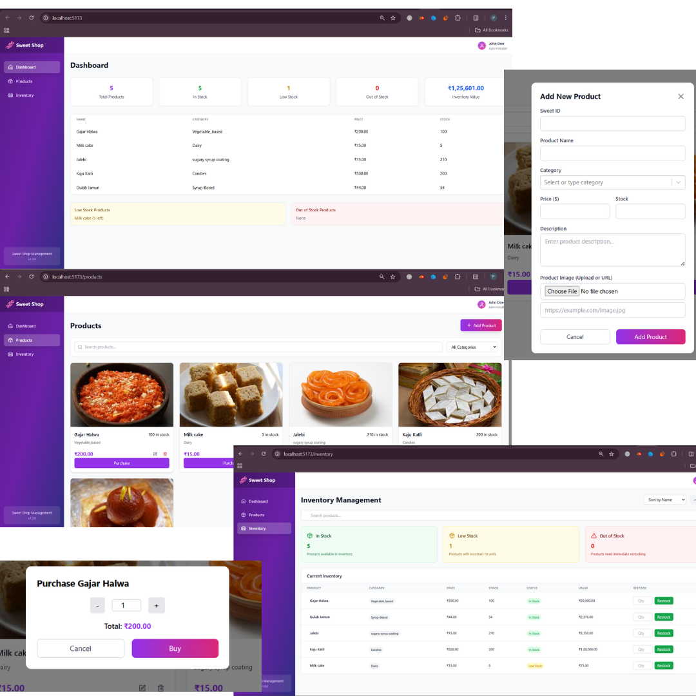

# Sweet Shop Management System

A full-stack web application for managing a sweet shop inventory built with React, Express.js, Node.js, and MongoDB.

## Features

### Core Operations
- ✅ **Add Sweets**: Add new sweets with unique ID, name, category, price, and quantity
- ✅ **Delete Sweets**: Remove sweets from inventory
- ✅ **View Sweets**: Display all available sweets with detailed information
- ✅ **Update Sweets**: Edit sweet details

### Search & Filter
- ✅ **Search**: Search sweets by name or category
- ✅ **Category Filter**: Filter by sweet categories
- ✅ **Sorting**: Sort by name, price, quantity, or category

### Inventory Management
- ✅ **Purchase Sweets**: Decrease stock quantity with validation
- ✅ **Restock Sweets**: Increase stock quantity

### Frontend Features
- 🎯 **User-friendly**: Intuitive interface with clear actions

## Tech Stack

### Backend
- **Node.js** - Runtime environment
- **Express.js** - Web framework
- **MongoDB** - Database
- **Mongoose** - ODM for MongoDB
- **Jest** - Testing framework
- **Supertest** - HTTP testing

### Frontend
- **React** - UI library
- **JavaScript** - Programming language
- **Tailwind CSS** - Styling

## Installation & Setup

### Prerequisites
- Node.js (v16 or higher)
- MongoDB (local or cloud instance)

### Backend Setup

1. **Clone the repository**
   \`\`\`bash
   git clone <repository-url>
   cd sweet-shop-management
   \`\`\`

2. **Install backend dependencies**
   \`\`\`bash
   cd backend
   npm install
   \`\`\`

3. **Environment Configuration**
   \`\`\`bash
   cp .env.example .env
   Edit .env with your MongoDB connection string
   \`\`\`

4. **Start MongoDB**
   \`\`\`bash
   If using local MongoDB
   mongod
   \`\`\`

5. **Run backend server**
   \`\`\`bash
   npm run dev
   \`\`\`
   Server will start on `http://localhost:5000`

### Frontend Setup

1. **Install frontend dependencies**
   \`\`\`bash
   From project root
   npm install
   \`\`\`

2. **Start development server**
   \`\`\`bash
   npm run dev
   \`\`\`
   Frontend will start on `http://localhost:3000`

## API Endpoints

### Sweets Management
- `GET /api/sweets` - Get all sweets (with search/filter)
- `POST /api/sweets` - Add new sweet
- `GET /api/sweets/:id` - Get sweet by ID
- `PUT /api/sweets/:id` - Update sweet
- `DELETE /api/sweets/:id` - Delete sweet

### Inventory Operations
- `POST /api/sweets/:id/purchase` - Purchase sweet (decrease stock)
- `POST /api/sweets/:id/restock` - Restock sweet (increase stock)

---

**Description for Test Image:**

> The image above displays the output of running automated backend tests for the Sweet Shop project using the command `npm test`. It shows that all test cases have passed successfully, including operations such as deleting a sweet, retrieving all sweets, searching and sorting sweets, purchasing, and restocking. This confirms that the core functionalities of the backend are working as expected, and the project is stable at this stage of development.

---

**Description for Frontend Design:**

**Description for Frontend Screenshot:**

The image above showcases the user interface of the Sweet Shop management system, highlighting several key features:

- **Dashboard:** Provides an overview of total products, stock status (in stock, low stock, out of stock), and the total inventory value. It also lists products that need attention, such as those low or out of stock.
- **Product Management:** Users can view all available sweets with images, prices, and stock information. The interface allows adding new products, updating existing product details, and deleting products. Any product added or updated here will automatically be reflected in both the Inventory and Dashboard sections.
- **Purchase Flow:** Users can purchase products by selecting the desired quantity, with the total price calculated automatically before confirming the purchase.
- **Inventory Management:** Displays a detailed list of all products, including their categories, prices, and current stock levels.  
    - **Restock:** Users can easily restock products directly from the inventory table, ensuring that stock levels are always up to date.
    - **Search & Sort:** The inventory table supports searching for specific products by name and sorting by different columns (such as price or stock), making it easy to find and manage products efficiently.
- **Data Synchronization:** Any changes made in product management (such as adding, updating, or deleting a product) are immediately visible in the Inventory and Dashboard sections, ensuring consistency across the application.

This frontend interface is designed to be intuitive and efficient, enabling shop owners to manage their sweets inventory seamlessly, keep track of stock, and ensure that all product information is always current and accessible.

