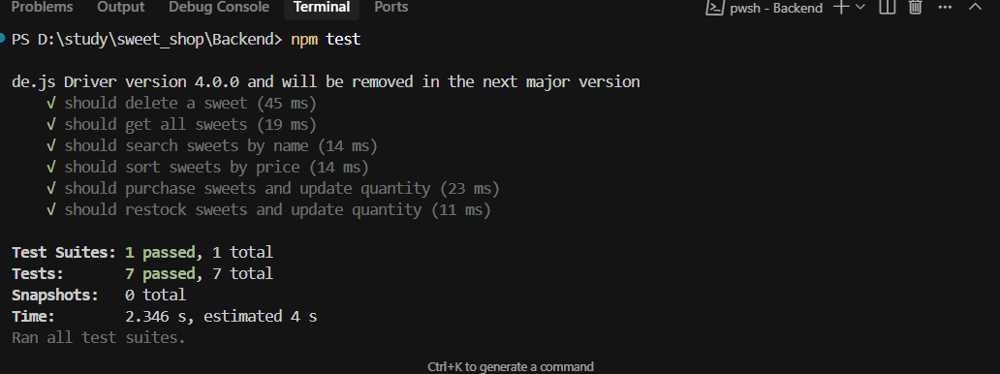

# Sweet Shop Management System

A full-stack web application for managing a sweet shop inventory built with React, Express.js, Node.js, and MongoDB.

## Features

### Core Operations
- ✅ **Add Sweets**: Add new sweets with unique ID, name, category, price, and quantity
- ✅ **Delete Sweets**: Remove sweets from inventory
- ✅ **View Sweets**: Display all available sweets with detailed information
- ✅ **Update Sweets**: Edit sweet details

### Search & Filter
- ✅ **Search**: Search sweets by name or category
- ✅ **Category Filter**: Filter by sweet categories
- ✅ **Sorting**: Sort by name, price, quantity, or category

### Inventory Management
- ✅ **Purchase Sweets**: Decrease stock quantity with validation
- ✅ **Restock Sweets**: Increase stock quantity

### Frontend Features
- 🎯 **User-friendly**: Intuitive interface with clear actions

## Tech Stack

### Backend
- **Node.js** - Runtime environment
- **Express.js** - Web framework
- **MongoDB** - Database
- **Mongoose** - ODM for MongoDB
- **Jest** - Testing framework
- **Supertest** - HTTP testing

### Frontend
- **React** - UI library
- **JavaScript** - Programming language
- **Tailwind CSS** - Styling

## Installation & Setup

### Prerequisites
- Node.js (v16 or higher)
- MongoDB (local or cloud instance)

### Backend Setup

1. **Clone the repository**
   \`\`\`bash
   git clone <repository-url>
   cd sweet-shop-management
   \`\`\`

2. **Install backend dependencies**
   \`\`\`bash
   cd backend
   npm install
   \`\`\`

3. **Environment Configuration**
   \`\`\`bash
   cp .env.example .env
   # Edit .env with your MongoDB connection string
   \`\`\`

4. **Start MongoDB**
   \`\`\`bash
   # If using local MongoDB
   mongod
   \`\`\`

5. **Run backend server**
   \`\`\`bash
   npm run dev
   \`\`\`
   Server will start on `http://localhost:5000`

### Frontend Setup

1. **Install frontend dependencies**
   \`\`\`bash
   # From project root
   npm install
   \`\`\`

2. **Start development server**
   \`\`\`bash
   npm run dev
   \`\`\`
   Frontend will start on `http://localhost:3000`

## API Endpoints

### Sweets Management
- `GET /api/sweets` - Get all sweets (with search/filter)
- `POST /api/sweets` - Add new sweet
- `GET /api/sweets/:id` - Get sweet by ID
- `PUT /api/sweets/:id` - Update sweet
- `DELETE /api/sweets/:id` - Delete sweet

### Inventory Operations
- `POST /api/sweets/:id/purchase` - Purchase sweet (decrease stock)
- `POST /api/sweets/:id/restock` - Restock sweet (increase stock)

---

**Description for Test Image:**

> This is a sample image used to verify that image embedding works correctly in Markdown files. It serves as a placeholder to ensure that images are displayed as expected in documentation or project READMEs.

You can include this description above or below your image in the Markdown file, like this:

```markdown


This is a sample image used to verify that image embedding works correctly in Markdown files. It serves as a placeholder to ensure that images are displayed as expected in documentation or project READMEs.
```
